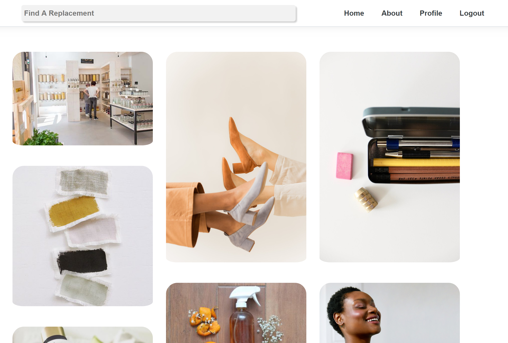

# Waste Not

Waste Note is a social media web application aimed to make living sustainably a little easier. Users can search for sustainable alternatives to products, save and share products via lists and browse the lists and profiles of other users. 

## Testing Locally

To run Waste Not locally:

1. Clone repository
1. Cd src
1. Run application
1. The application can be used without an account, but if you would like to save lists it is suggested that you register for an account.
1. Explore the application at your leisure

<!-- ## User Walkthrough -->
## Technology Used

C#  
.NET Framework  
Entity Framework  
Identity Framework  

## Contributors

Asia Carter

